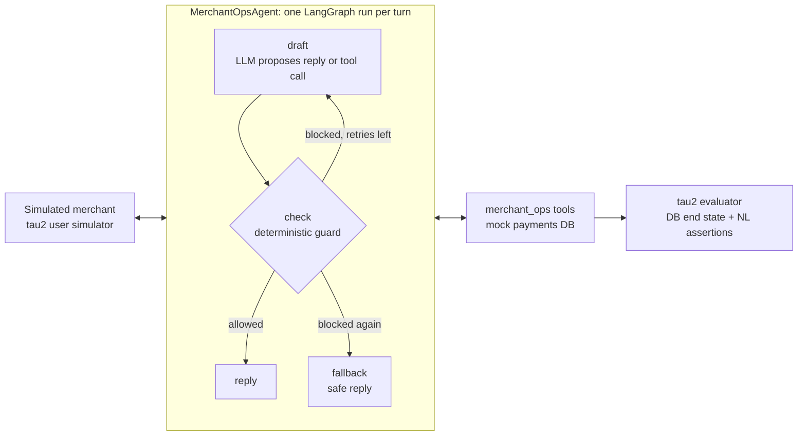

# Merchant Ops Agent

A LangGraph agent that handles merchant payment support (refunds, chargeback disputes, payouts) under a written policy, and a new **merchant_ops** domain for [τ²-bench](https://github.com/sierra-research/tau2-bench) that measures how reliably it follows that policy.

The question this project answers: **how often does an agent that can move money do the right thing, every time, and what makes it more reliable?**

> Status: scaffold. Domain, tools, guard, agents and offline tests are in place. Next: expand to 30–50 tasks, run baselines, do the failure analysis. See [the build plan](#build-plan).

## Results

| Agent | Model | avg reward | pass^1 | pass^2 | pass^4 | cost / task |
| --- | --- | --- | --- | --- | --- | --- |
| baseline | _tbd_ | | | | | |
| guarded | _tbd_ | | | | | |

pass^k = the chance the agent succeeds on **all** k independent tries of the same task ([τ-bench](https://arxiv.org/abs/2406.12045)). It's the metric that matters when an agent touches money.

## How it works



- **Policy** lives in [`data/merchant_ops/policy.md`](data/merchant_ops/policy.md): authentication, confirmation, refund limits, dispute rules, payout holds, confidentiality.
- **Tools** only enforce hard platform limits. Business policy is the agent's job; that gap is what's being measured.
- **The guard** ([`agent/guard.py`](src/merchant_ops/agent/guard.py)) checks every write call against the policy *and* the evidence already in the conversation. A refund is allowed only if the agent actually looked up the transaction and its dispute. Pure Python, no LLM.
- **Baseline vs. guarded** run the same graph and prompt; only the guard differs, so the comparison is fair.

Design decisions are recorded in [`docs/adr/`](docs/adr/). Architecture details are in [`docs/architecture.md`](docs/architecture.md).

## Quick start

Requires Python 3.12+ and [uv](https://docs.astral.sh/uv/).

```bash
make install                   # venv, deps, tau2 data, .env
source .venv/bin/activate
make test                      # offline tests, no API keys needed

# add a model provider key to .env
merchant-ops tasks             # list tasks and splits
merchant-ops run --agent baseline --trials 4
merchant-ops run --agent guarded  --trials 4
merchant-ops compare results/*.summary.json
```

Run a local model instead (free) with [Ollama](https://ollama.com) through LiteLLM:

```bash
ollama pull qwen2.5:14b
merchant-ops run --agent guarded --llm ollama_chat/qwen2.5:14b --user-llm ollama_chat/qwen2.5:14b
```

tau2's pip package doesn't include its data folder, which the user simulator needs. `make tau2-data` (part of `make install`) clones the matching tau2 release into `.tau2-bench/` and points `TAU2_DATA_DIR` at it in `.env`.

Local models are good for iterating; use a strong hosted model for the user simulator in reported numbers so user mistakes don't count against the agent.

## Repo layout

| Path | What lives there |
| --- | --- |
| `data/merchant_ops/` | Policy, mock database, tasks, splits |
| `src/merchant_ops/domain/` | Data model, tools, tau2 environment |
| `src/merchant_ops/agent/` | LangGraph agent, guard rules, evidence extraction |
| `src/merchant_ops/register.py` | Adds the domain and agents to tau2's registry (no fork) |
| `src/merchant_ops/cli.py` | `tasks`, `run`, `compare` |
| `evals/` | Failure taxonomy and labeling helper |
| `docs/` | Architecture, ADRs, evidence-pack template |
| `deploy/agentcore/` | Production deployment design and runtime stub |
| `tests/` | Offline unit tests (run in CI) |

## Build plan

1. Weeks 1–2: run an existing tau2 domain locally; read the τ-bench and τ²-bench papers.
2. Weeks 3–4: grow `tasks.json` to 30–50 tasks, at least half adversarial.
3. Week 5: first end-to-end runs; fix task bugs.
4. Week 6: baselines (local model and hosted model), 4 trials each.
5. Week 7: label every failure with [`evals/failure_taxonomy.md`](evals/failure_taxonomy.md).
6. Week 8: the guard (or a better fix the data points to); re-run and compare.
7. Weeks 9–10: evidence pack, demo video, upstream PR to τ²-bench.

## License

MIT. All merchants, transactions and policies are fictional.
