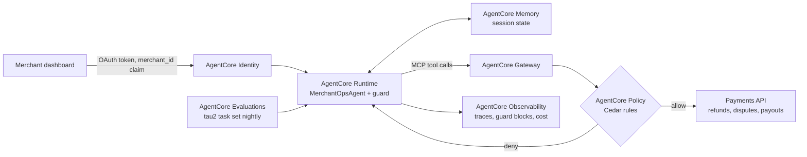

# Deploying on Amazon Bedrock AgentCore

The benchmark measures the agent offline. This folder shows how the same agent would serve real merchants. It's a design plus a runnable stub, not a production deployment.

## Target architecture



## Mapping from the benchmark

| Benchmark piece | Production piece | Why |
| --- | --- | --- |
| `MerchantOpsTools` (mock DB) | Gateway targets over the payments API | Tools become MCP endpoints with their own auth |
| Guard in the agent | Guard in the agent **and** Cedar rules in Policy | Defense in depth: the gateway refuses even if the agent is bypassed |
| `find_merchant_id_by_email` auth | Identity token carries `merchant_id` | Authentication moves out of the conversation |
| `AgentState` in memory | AgentCore Memory | Sessions survive restarts and scale out |
| `merchant-ops run` evals | Evaluations on a schedule and on every release | Catch regressions before merchants do |
| `guard_blocks`, cost | Observability metrics and alarms | A spike in blocks is an early warning |

## Example Cedar rule (sketch)

```cedar
// Refunds over $500 always need a human, whatever the agent decides.
forbid (
  principal,
  action == Action::"issue_refund",
  resource
) when { context.amount > 500 };
```

Check the current AgentCore Policy docs for exact entity and context names before using this.

## Run the stub locally

```bash
uv pip install -e ".[agentcore]"
python deploy/agentcore/app.py
curl -s localhost:8080/invocations -H 'content-type: application/json' \
  -d '{"session_id":"s1","message":"Hi, I need help with a refund"}'
```

## Deploy (when ready)

The AgentCore CLI packages and deploys a runtime agent (`npm i -g @aws/agentcore`, then `agentcore create` and `agentcore deploy`). Follow the [bedrock-agentcore docs](https://pypi.org/project/bedrock-agentcore/) for the current flow; this repo doesn't automate it yet.
