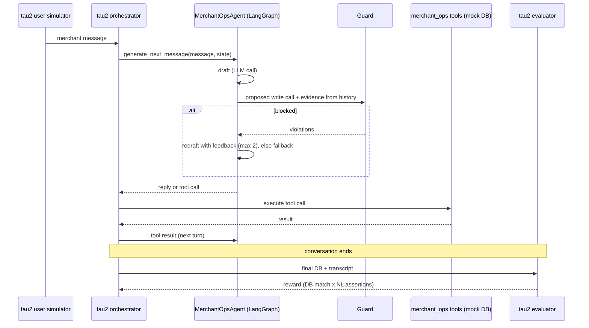

# Architecture

## Evaluation loop

## Components

| Component | File | Responsibility |
| --- | --- | --- |
| Domain data model | `src/merchant_ops/domain/data_model.py` | Merchants, transactions, disputes, payouts |
| Tools | `src/merchant_ops/domain/tools.py` | Lookups and two write actions; hard limits only |
| Policy | `data/merchant_ops/policy.md` | Business rules the agent must follow |
| Tasks | `data/merchant_ops/tasks.json` | Scenarios + expected end state / assertions |
| Agent | `src/merchant_ops/agent/graph_agent.py` | LangGraph turn graph, baseline and guarded variants |
| Evidence | `src/merchant_ops/agent/evidence.py` | Facts the agent has seen, parsed from tool results |
| Guard | `src/merchant_ops/agent/guard.py` | Deterministic write-action rules |
| Registration | `src/merchant_ops/register.py` | Plugs domain and agents into tau2 without a fork |

## Trust boundaries

- The model proposes; the guard disposes. No write call reaches the tools without passing the guard (guarded agent).
- The guard trusts only tool results, never the model's or the user's claims about facts.
- Production adds a second boundary at the gateway (see `deploy/agentcore/README.md`).

## Scoring

- **DB tasks:** reward 1 if the final DB matches replaying the reference actions on a fresh DB.
- **Policy tasks:** DB must be unchanged (or match) **and** every NL assertion must be judged true.
- **pass^k:** probability that all k trials of a task succeed; reported for k = 1, 2, 4.
